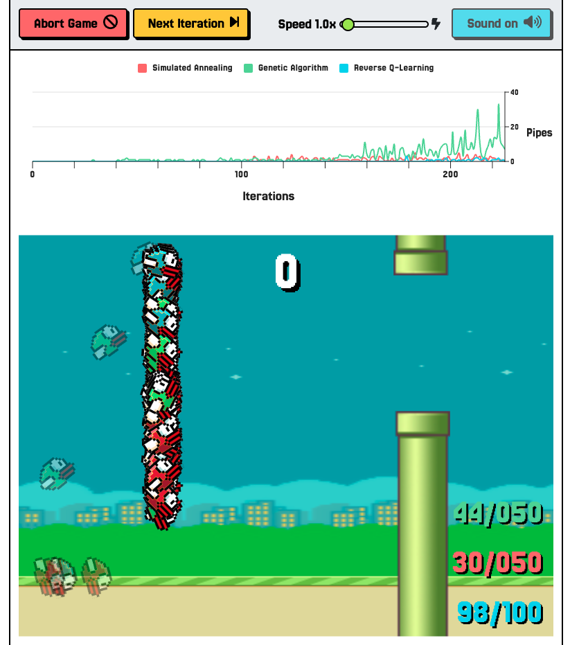
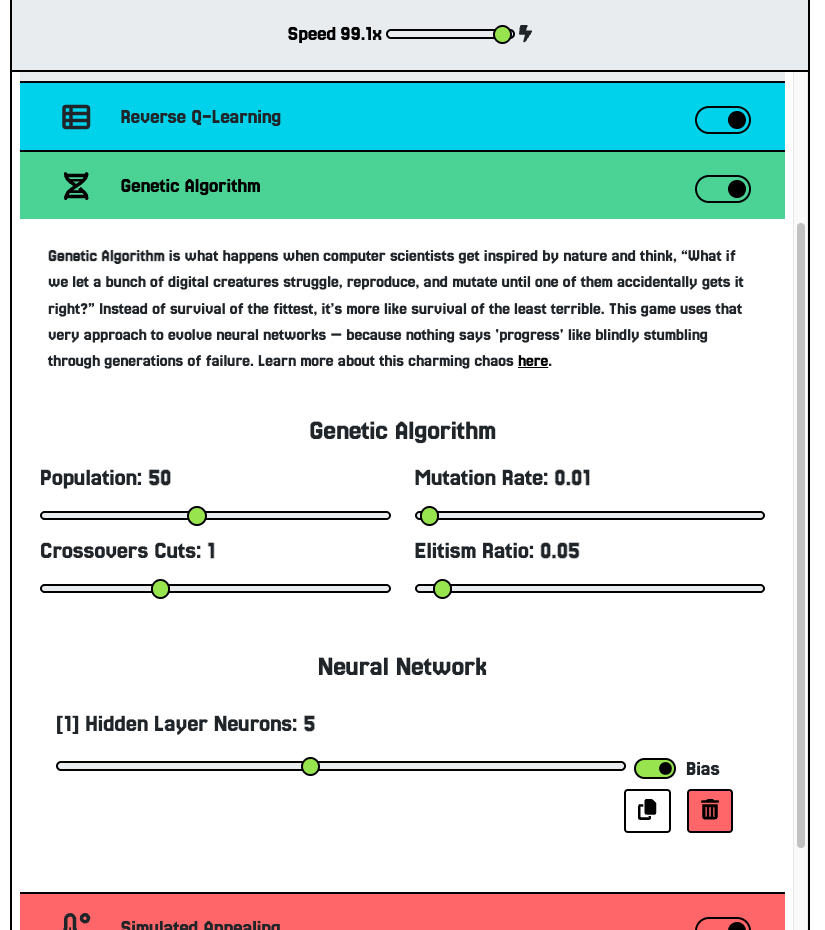

# flappy-bird-ai

Yes. You read it right. It’s *another* Flappy Bird AI. Because the world clearly doesn’t have enough of those, and I apparently have too much free time and a deep desire to make a pixelated bird suffer in the name of science.

If you haven’t stumbled upon my other masochistic coding experiments yet, you’re missing out on a symphony of algorithms and existential despair. Here, educate yourself:

* [Pacman](https://github.com/virgs/pacman) — because eating ghosts is more fulfilling than eating real food.
* [Minesweeper AI](https://github.com/virgs/minesweeper-ai) — where AI learns to click and die just like humans.
* [2048 AI](https://github.com/virgs/2048-ai) - AI learns how to multiply by 2.
* [Sudoku](https://github.com/virgs/sudoku) — because solving math puzzles is what sane people do for fun.
* [Rubik's Cubes AI](https://github.com/virgs/rubiks-cubes-ai) — it solves what your hands gave up on years ago.
* [Mancala](https://github.com/virgs/mancala) — yes, that game you vaguely remember from childhood.
* [Tetris](https://github.com/virgs/tetris) — *Please rotate piece. Please rotate pie—oh it’s dead.*
* [Navigator's Gamble](https://github.com/virgs/navigators-gamble) — a fancy name for AI playing with uncertainty and pain.

---

## Overview

This project was built mostly for fun, but also as a platform to explore different AI techniques applied in games. If you're reading a book of mine about AI in games, this might look familiar.
This abomination of digital feathers was cobbled together for the unholy trinity of reasons:

1. **Learn Neuroevolution** — which is a fancy way of saying “throw random numbers at a neural net and hope it learns to jump at the right time before faceplanting into a pipe.” Think of it as natural selection, but with fewer ethics and more pipes.

2. **Simulated Annealing** — because nothing says “solid learning” like slowly turning down the temperature on randomness until the AI finally gives up and flaps like it's drunk but determined.

3. **Reverse Q-Learning** — technically reinforcement learning, but flipped around, confused, disoriented, and mostly ineffective. Spoiler: it did not go well.

4. **Make AI visual and tweakable** — so you, dear reader, can play God and mutate birds at will like a caffeinated Darwin with a debugger. 

5. **Have fun** — Or at least tell yourself that’s what you’re doing while watching the 800th bird nose-dive into a pipe.

Wanna see the chaos live or challenge the AI to a duel? [Here you go, brave soul](https://virgs.github.io/flappy-bird-ai). Just don’t blame me when it wins. Or loses. Or just awkwardly flaps into oblivion.

---

## Outcomes

Let’s review what worked, what sort of worked, and what will haunt me in my dreams:

1. **Neuroevolutionary**
   Worked as expected. With default settings, it consistently produced birds capable of surviving thousands of pipes (depending only on your patience level) — often in under 50 generations.

2. **Simulated Annealing**
   Surprisingly efficient. Beat the Neuroevolutionary approach. It managed to train networks that performed well in every run (aka plays forever), usually within 30 iterations.

3. **Reverse Q-learning**
   This one didn’t deliver. Despite many parameter tweaks, it struggled to produce a consistently successful bird. Some runs managed to survive around 50 pipes, but most failed to converge on a stable solution — even after 3,000 iterations with a population of 100. Could be improved, or maybe it's just not the best fit for this problem.

---

If you're here to learn, poke around, or just watch birds fail at life with mathematical precision — welcome. The code’s yours, the mess is mine.
This project is meant to be a learning resource and a sandbox for experimentation. If you find something interesting (or break it in creative ways), feel free to reach out or fork it.